## bot_challenge

This flow clarifies that the user is talking to a chatbot, when the user ask if they are talking to a chatbot or a human

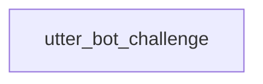

## leave_feedback

This flow collects simple thumbs up or thumbs down feedback

**Flow Guard:** if: False (only triggered via call/link)

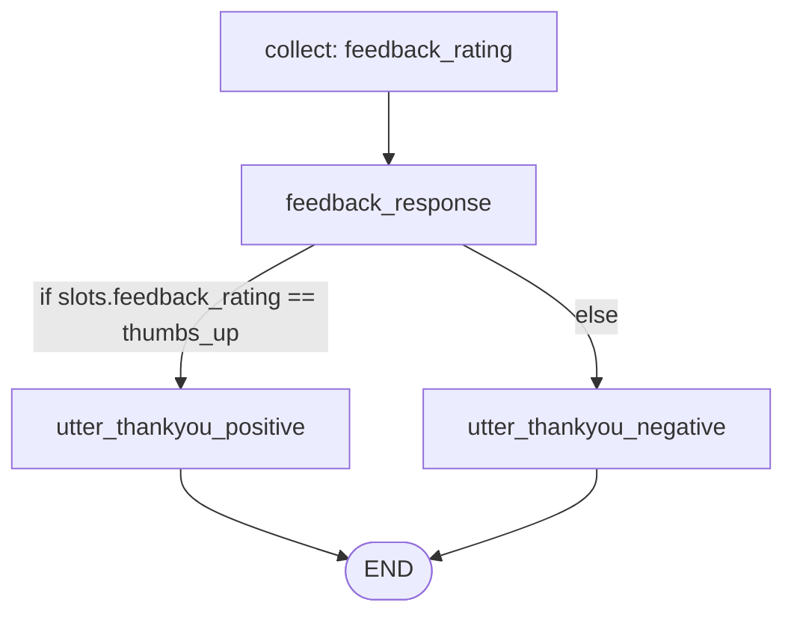

## goodbye

Handle user goodbye messages, say farewell, and collect feedback

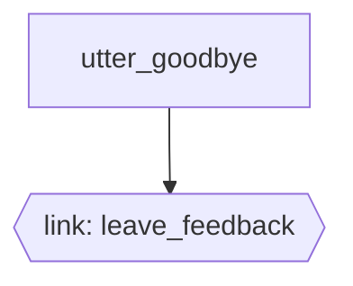

## hello

Flow for greeting the user hello


## help

This flow addresses user inquiries about the agent's capabilities. It starts by acknowledging the user's request and providing a clear overview of key skills and services. This helps users understand how the agent can assist them effectively.

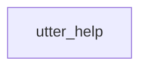

## human_handoff

When you are unable to handle the request or the user is frustrated - offers to hand the user over to a live human agent.

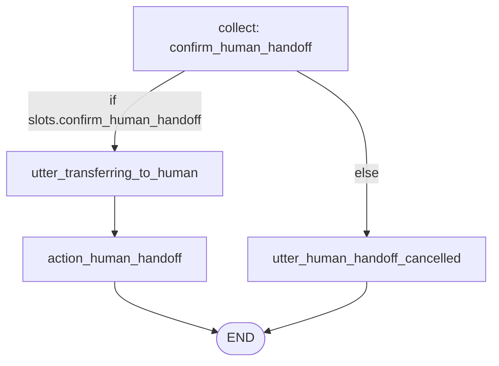

## welcome

This flow is designed to greet and onboard new users who initiate a welcome intent.
It begins with an initial greeting message to establish a friendly interaction.


**Flow Guard:** if: False (only triggered via call/link)

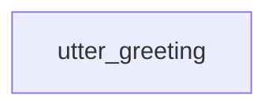

## activate_card

Activates user's card.

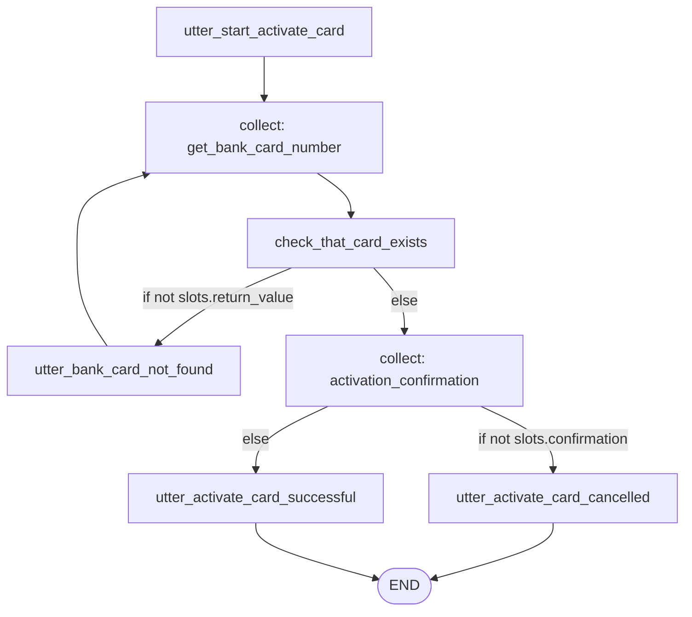

## block_card

Applies a permanent or temporary block to stolen, lost or compromised banking cards.

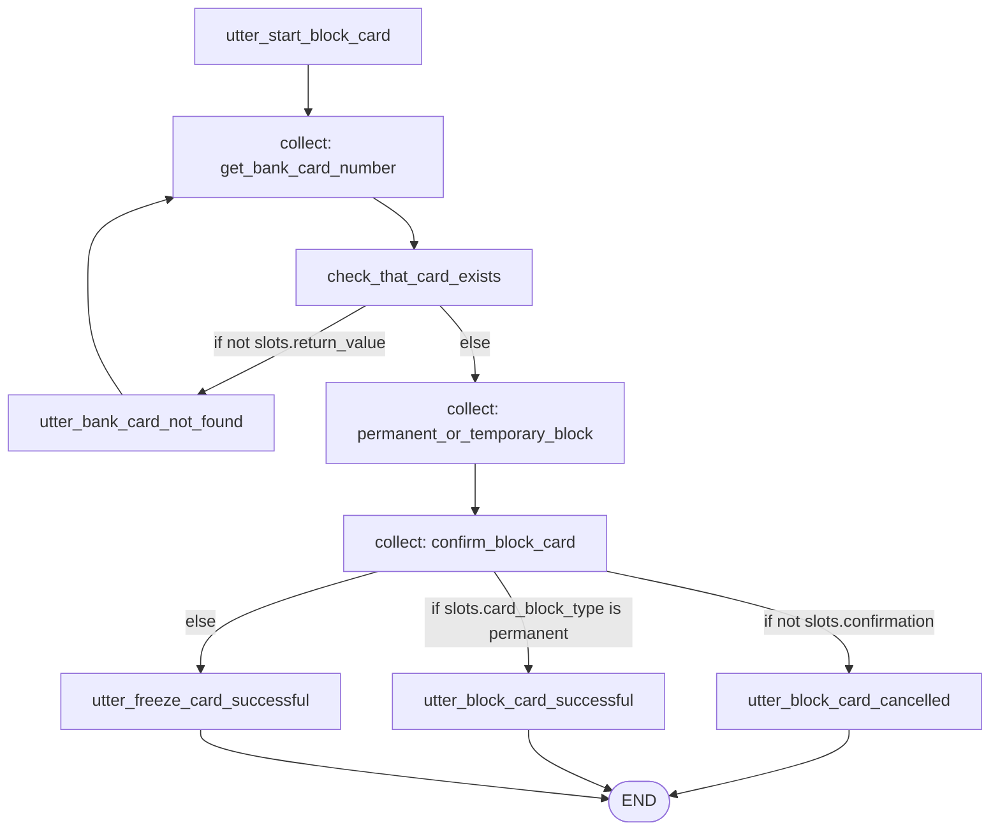

## list_cards

show your card list

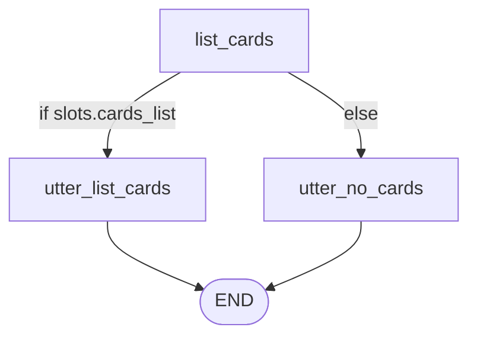

## replace_card

Replaces an existing card if it’s lost, stolen, damaged, or compromised (including suspected fraud).

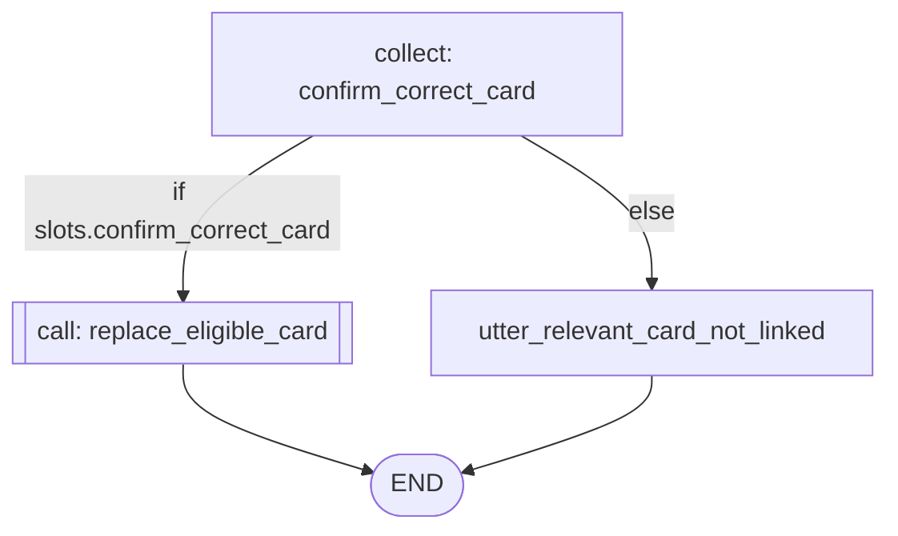

## replace_eligible_card

Guides the user through replacing an eligible card based on the reason (lost, damaged, or unknown)
and addresses potential fraud if needed


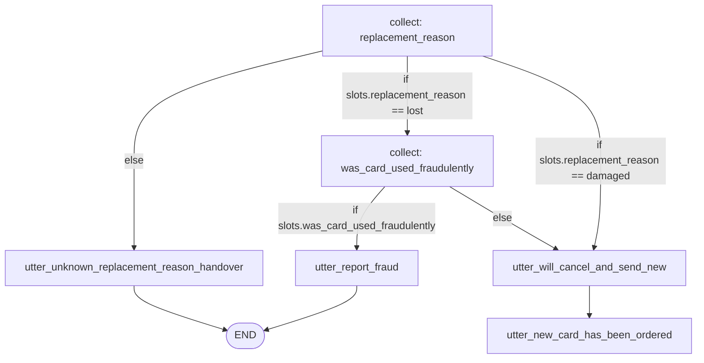

## add_contact

Add a person with their contact details to your contacts list to enable simplified payments.

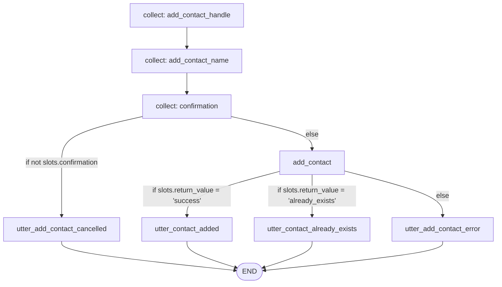

## list_contacts

show your contact list

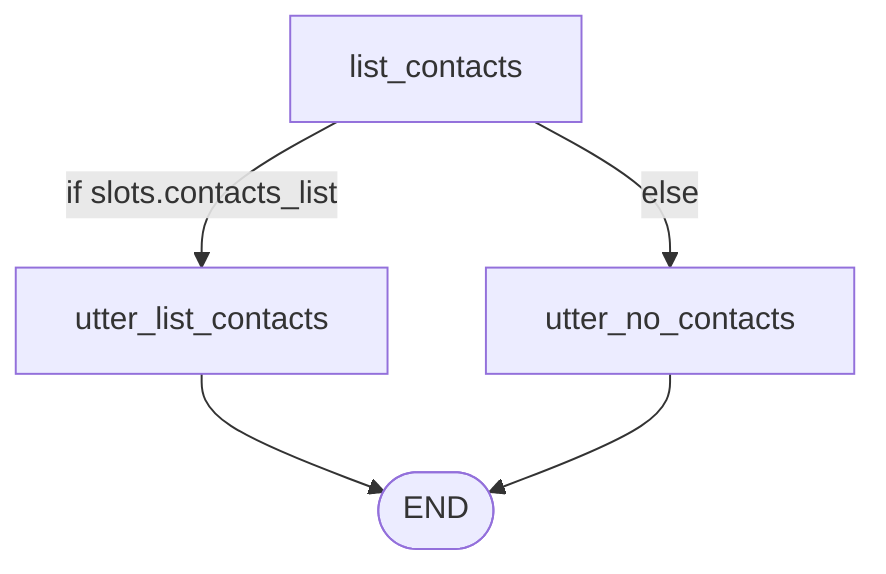

## remove_contact

Remove somebody and their details from your contacts list.

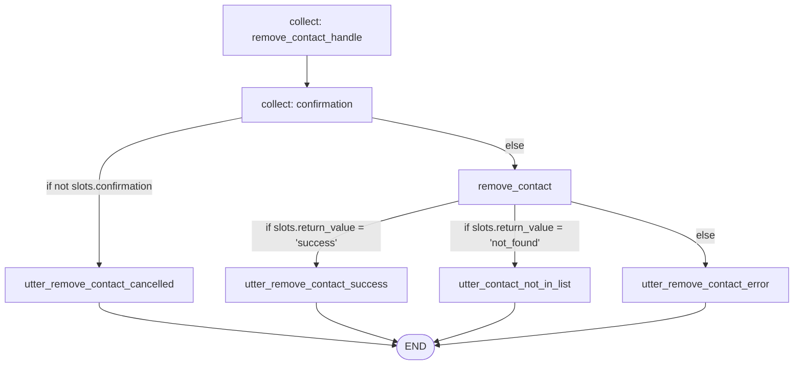

## check_transfer_limit

Provides the maximum allowed amount the user can send or transfer per transaction, per day, or per month, as set by account policies—not the current available balance.

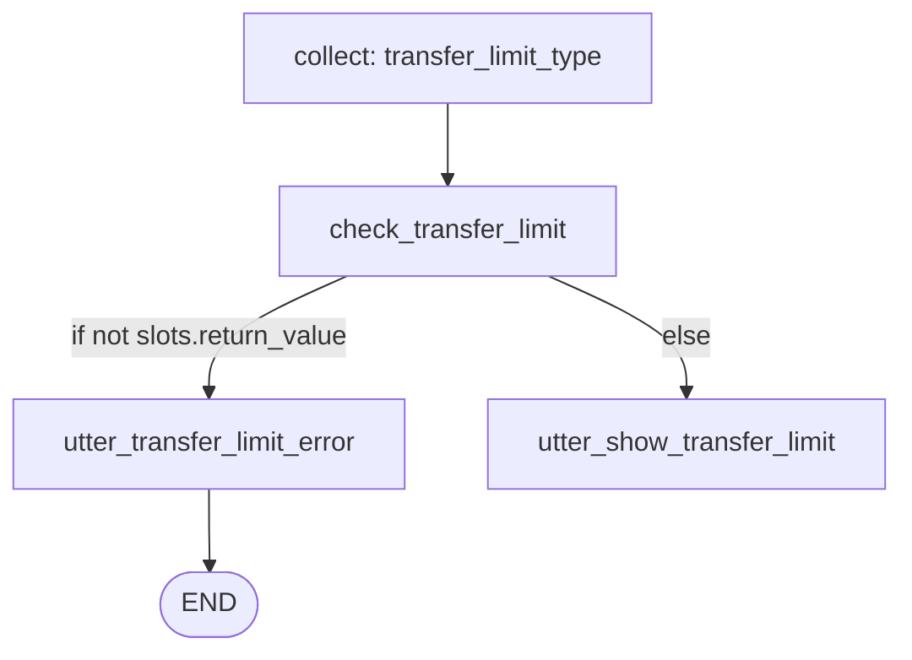

## list_payees

List your payees or authorised recipients for money transfers. 
Show the people in your contact list who are valid payees you can transfer money to.


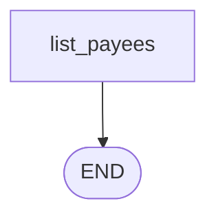

## list_transactions

Enables users to quickly view their most recent account transactions. 
After presenting these, the users has the option to view their scheduled (upcoming) 
transactions.


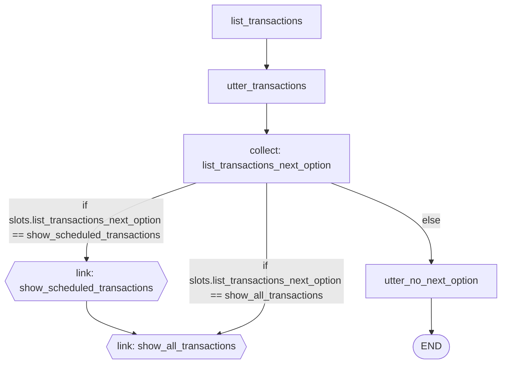

## move_money_between_accounts

Transfers money between user's own accounts.

**Flow Guard:** if: False (only triggered via call/link)

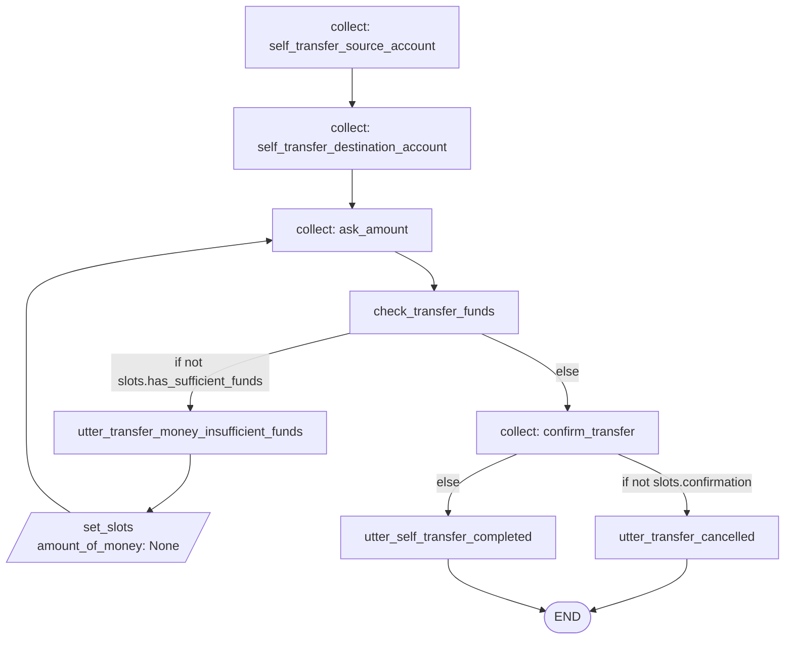

## transfer_money

Handles the following types of money transfers initiated by the user:
- Third Party: Transfer money to another person, business or service within domestic banks. Third party transfer can be immediate, scheduled, or set up as a recurring payments.
- Self transfer: Transfer funds between user's own accounts at the same bank (immediate only).


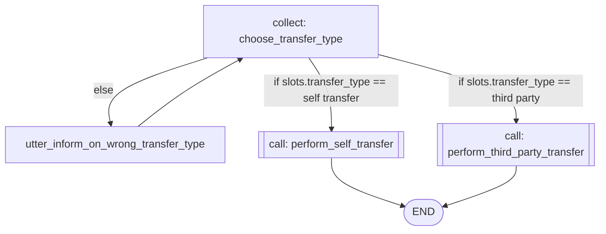

## transfer_money_to_a_third_party

Transferring money to someone else, such as friends, family, or businesses. This
includes paying bills, rent, subscriptions, or transferring money to accounts
outside the user's own portfolio. Third party transfers are limited to recipients
with accounts at domestic banks. Supports immediate, scheduled, and recurring
transfers.


**Flow Guard:** if: False (only triggered via call/link)

```mermaid
graph TD
    END([END])
    recipient_account[collect: recipient_account]
    validate_payee[validate_payee]
    utter_invalid_payee[utter_invalid_payee]
    set_recipient_account_3[/set_slots<br/>recipient_account: None/]
    ask_amount[collect: ask_amount]
    check_transfer_funds[check_transfer_funds]
    utter_transfer_money_insufficient_funds[utter_transfer_money_insufficient_funds]
    set_amount_of_money_7[/set_slots<br/>amount_of_money: None/]
    choose_transfer_timing_type[collect: choose_transfer_timing_type]
    utter_inform_on_wrong_transfer_timing_type[utter_inform_on_wrong_transfer_timing_type]
    execute_immediate_transfer[[call: execute_immediate_transfer]]
    setup_scheduled_transfer[[call: setup_scheduled_transfer]]
    setup_recurring_payment[[call: setup_recurring_payment]]
    recipient_account --> validate_payee
    utter_invalid_payee --> set_recipient_account_3
    ask_amount --> check_transfer_funds
    utter_transfer_money_insufficient_funds --> set_amount_of_money_7
    validate_payee -->|if not slots.is_valid_payee| utter_invalid_payee
    validate_payee -->|else| ask_amount
    set_recipient_account_3 --> END
    check_transfer_funds -->|if not slots.has_sufficient_funds| utter_transfer_money_insufficient_funds
    check_transfer_funds -->|else| choose_transfer_timing_type
    set_amount_of_money_7 --> ask_amount
    choose_transfer_timing_type -->|if slots.transfer_timing_type == immediate| execute_immediate_transfer
    choose_transfer_timing_type -->|if slots.transfer_timing_type == scheduled| setup_scheduled_transfer
    choose_transfer_timing_type -->|if slots.transfer_timing_type == recurring| setup_recurring_payment
    choose_transfer_timing_type -->|else| utter_inform_on_wrong_transfer_timing_type
    utter_inform_on_wrong_transfer_timing_type --> choose_transfer_timing_type
    execute_immediate_transfer --> END
    setup_scheduled_transfer --> END
    setup_recurring_payment --> END
```

## pattern_completed

A flow has been completed and there is nothing else to be done

**Flow Guard:** if: False (only triggered via call/link)

```mermaid
graph TD
```

## pattern_correction

Handle a correction of a slot value.

```mermaid
graph TD
    END([END])
    action_correct_flow_slot[action_correct_flow_slot]
    action_correct_flow_slot --> END
```

## pattern_search

Flow for handling knowledge-based questions

```mermaid
graph TD
    END([END])
    0_action_trigger_search[action_trigger_search]
    0_action_trigger_search --> END
```

## pattern_session_start

Flow for starting the conversation

**nlu_trigger:**
- session_start (confidence_threshold: 0.8)
- test (confidence_threshold: 0.5)

```mermaid
graph TD
    welcome{{link: welcome}}
```

## bill_pay_reminder

Help users set up automatic reminders for recurring bill payments.

```mermaid
graph TD
    END([END])
    biller_name[collect: biller_name]
    bill_due_date[collect: bill_due_date]
    reminder_frequency[collect: reminder_frequency]
    confirm_reminder[collect: confirm_reminder]
    utter_bill_pay_reminder_cancelled[utter_bill_pay_reminder_cancelled]
    setup_bill_pay_reminder[utter_bill_pay_reminder_complete]
    biller_name --> bill_due_date
    bill_due_date --> reminder_frequency
    reminder_frequency --> confirm_reminder
    confirm_reminder -->|if not slots.confirmation| utter_bill_pay_reminder_cancelled
    confirm_reminder -->|else| setup_bill_pay_reminder
    utter_bill_pay_reminder_cancelled --> END
    setup_bill_pay_reminder --> END
```

## check_balance

Guides the user through retrieving their account balance by requesting an
account number or an account name and returning the balance on the selected account


```mermaid
graph TD
    check_balance[check_balance]
    utter_current_balance[utter_current_balance]
    check_balance --> utter_current_balance
```

## download_statements

Allow users to download their monthly account statements in PDF or CSV format.

```mermaid
graph TD
    END([END])
    statement_month[collect: statement_month]
    statement_year[collect: statement_year]
    statement_format[collect: statement_format]
    confirmation[collect: confirmation]
    utter_statement_download_cancelled[utter_statement_download_cancelled]
    initiate_download[utter_statement_download_complete]
    statement_month --> statement_year
    statement_year --> statement_format
    statement_format --> confirmation
    confirmation -->|if not slots.confirmation| utter_statement_download_cancelled
    confirmation -->|else| initiate_download
    utter_statement_download_cancelled --> END
    initiate_download --> END
```

